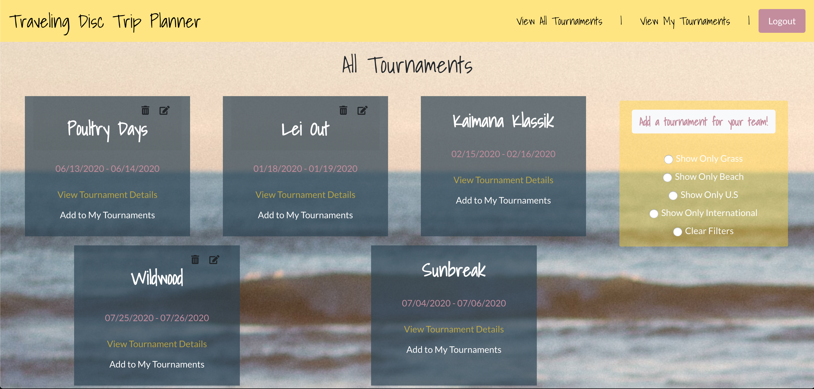
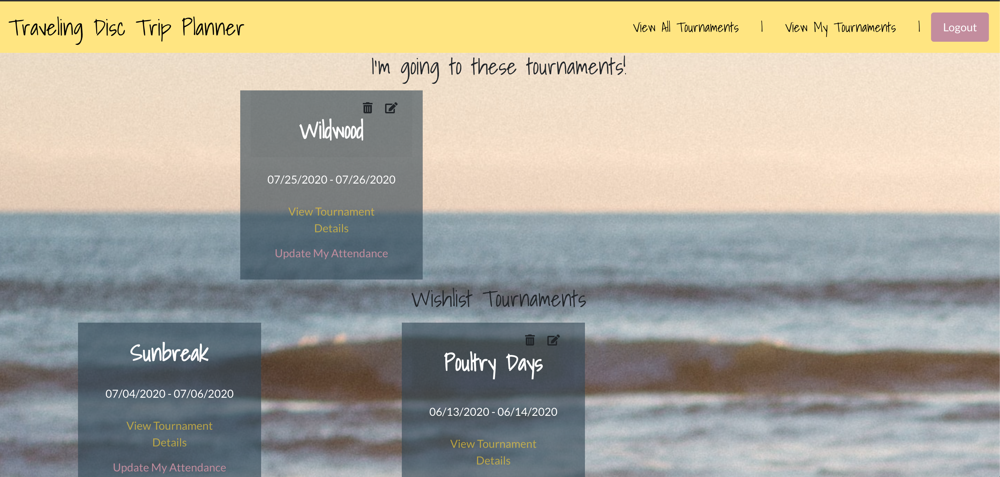
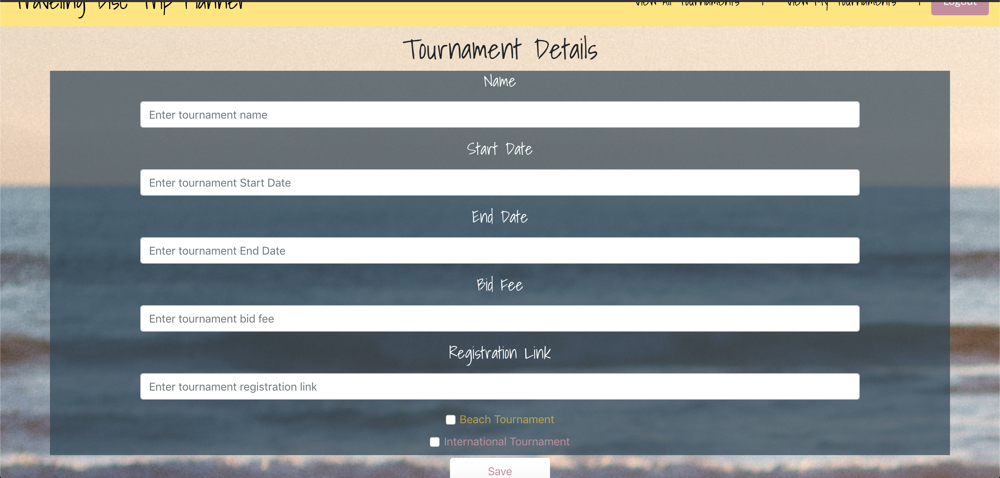
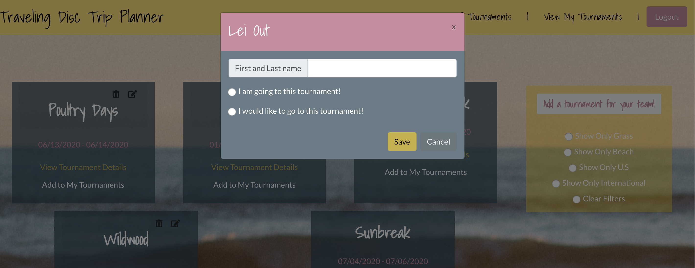
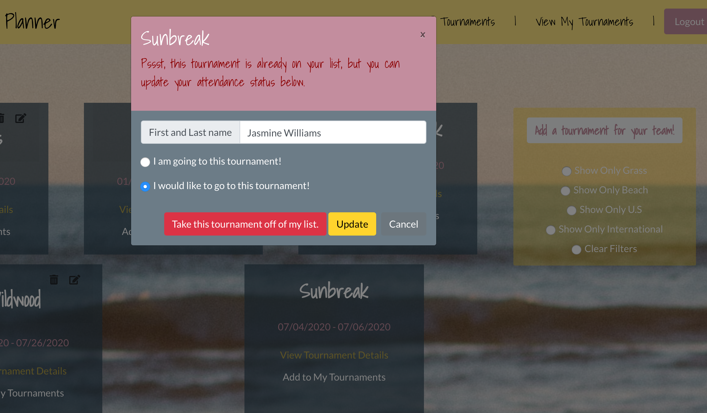
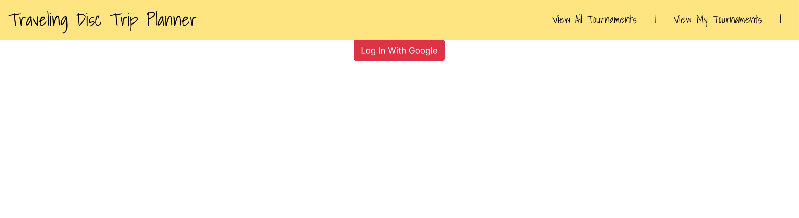

# Traveling Disc

## Description

## Technologies Used

- Single page web application created using **React**
- **React routing** was used to navigate throughout the application
- Full **CRUD** is completed on the tournament collection and player collection using Firebase as the database
- **Reactstrap** was used to create the popup modal for the player status form
- **Bootstrap** for grid layout control and simple margins
- **Sass** for all other styling

#### Versions

- React: 16.12.0
- Reactstrap: 8.4.1
- Axios: 0.19.1
- Bootstrap: 4.4.1
- Firebase: 7.7.0
- Node-sass: 4.13.1

## Screenshots

### Homepage View

### Personal Tournaments View

### Create a New Tournament View

### Add to Personal Tournaments View

### Update Attendance Status View

### Logged Out View

## Live Demo

Click [here](https://traveling-disc.web.app/) to try out the live demo.

## How To Run

- Clone down the project
- In the terminal run `npm install`
- Create a firebase project [here](https://console.firebase.google.com/)
- Create `src/helpers/apiKeys.json` file and add in your firebase keys that were created in the new firebase project. Feel free to reference the `apiKeys.example.json` file in the project for the correct structure.
- Once set up to run enter the following in the terminal `npm start`

## Future Features

- Carpooling Organization between interested and attending players.
- Rate/Review Past Tournaments Attended.

## Contributors

[Jasmine Williams](https://github.com/williaj615)
